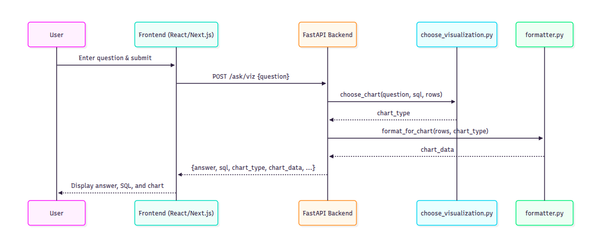
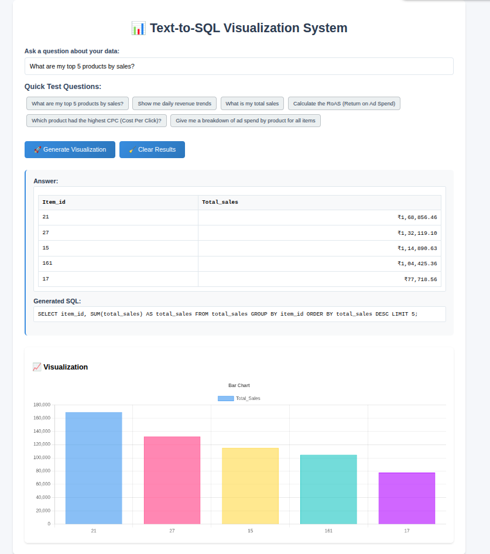

# Text-to-SQL Visualization System

This project is a web-based application that allows users to ask questions in natural language about their e-commerce data. The system converts the user's question into an SQL query, executes it against a database, and displays the results. It also automatically generates an appropriate visualization (e.g., bar chart, line chart, pie chart) based on the query and the data.

## Features

- **Natural Language to SQL:** Users can ask questions in plain English (e.g., "what were my total sales last month?").
- **Automatic Visualization:** The system automatically chooses and displays the best chart to represent the data.
- **Interactive Frontend:** A Next.js and React-based user interface for entering questions and viewing results.
- **FastAPI Backend:** A Python-based backend using FastAPI to handle the logic for SQL generation and data fetching.
- **Gemini API Integration:** Uses Google's Gemini for the natural language processing and chart recommendation tasks.

## Architecture

The application is composed of two main parts:

1.  **Backend (FastAPI):**

    - `main.py`: The main FastAPI application file that defines the API endpoints.
    - `text_to_sql.py`: Handles the conversion of natural language questions to SQL queries using the Gemini API.
    - `choose_visualization.py`: Determines the best visualization type for the given data.
    - `formatter.py`: Formats the data into a structure that can be used by the frontend for charting.
    - `db.py`: Manages the database connection.
    - `schema_helper.py`: Provides the database schema to the language model.

2.  **Frontend (Next.js):**
    - `text-to-sql-app/`: The root directory for the Next.js application.
    - `src/app/page.tsx`: The main page of the application.
    - `src/components/`: Contains the React components for the UI (query input, results display, charts).

### Architecture Diagram



## App Frontend Image



## Setup and Running the Project Locally

Follow these steps to run the project on your local machine.

### Prerequisites

- Python 3.8+
- Node.js 18+
- An active Google AI Studio API key with the Gemini API enabled.

### Backend Setup

1.  **Clone the repository:**

    ```bash
    git clone <repository-url>
    cd ecommerce-ai-agent
    ```

2.  **Create a virtual environment and install dependencies:**

    ```bash
    python -m venv agentai
    source agentai/bin/activate  # On Windows use `agentai\Scripts\activate`
    pip install -r requirements.txt
    ```

3.  **Set up your API key:**
    Create a `.env` file in the root of the project and add your Gemini API key:

    ```
    GEMINI_API_KEY="YOUR_GEMINI_API_KEY"
    ```

4.  **Run the FastAPI server:**
    ```bash
    uvicorn main:app --reload
    ```
    The backend will be running at `http://127.0.0.1:8000`.

### Frontend Setup

1.  **Navigate to the frontend directory:**

    ```bash
    cd text-to-sql-app
    ```

2.  **Install Node.js dependencies:**

    ```bash
    npm install
    ```

3.  **Set up the API key for the frontend:**
    Create a `.env.local` file in the `text-to-sql-app` directory and add the following environment variable. This tells the Next.js app where the backend is running.

    ```
    NEXT_PUBLIC_API_BASE="http://127.0.0.1:8000"
    ```

4.  **Run the Next.js development server:**

    ```bash
    npm run dev
    ```

    The frontend will be running at `http://localhost:3000`.

5.  **Open your browser:**
    Navigate to `http://localhost:3000` to use the application.

## API Endpoints

The main API endpoint provided by the FastAPI backend is:

- `POST /ask/viz`:
  - Takes a JSON payload with a "question" field (e.g., `{"question": "What are the top 5 selling products?"}`).
  - Returns a JSON response containing the answer, the generated SQL query, and the data formatted for visualization.

### Example

**Request:**

```bash
curl -X POST http://localhost:8000/ask/viz \
  -H "Content-Type: application/json" \
  -d '{"question":"calculate the RoAS (Return on Ad Spend)"}'
```

**Response:**

```json
{
  "answer": "Result: 7.123479455901441",
  "sql": "SELECT SUM(ad_sales) / SUM(ad_spend) AS roas FROM ad_sales WHERE ad_spend > 0;",
  "chart_type": "none",
  "chart_data": null,
  "success": true,
  "debug_info": {
    "rows_count": 1,
    "columns": ["roas"],
    "chart_formatted": false
  }
}
```

**Another Example:**

**Request:**

```bash
curl -X POST http://localhost:8000/ask/viz \
  -H "Content-Type: application/json" \
  -d '{"question":"Show me daily revenue trends"}'
```

**Response:**

```json
{
  "answer": "Found 14 results: [{'date': '2025-06-01 00:00:00', 'revenue': 35500.25}, {'date': '2025-06-02 00:00:00', 'revenue': 38854.82}, {'date': '2025-06-03 00:00:00', 'revenue': 25980.760000000002}, {'date': '2025-06-04 00:00:00', 'revenue': 27791.6}, {'date': '2025-06-05 00:00:00', 'revenue': 23431.55}, {'date': '2025-06-06 00:00:00', 'revenue': 30737.95}, {'date': '2025-06-07 00:00:00', 'revenue': 28061.26}, {'date': '2025-06-08 00:00:00', 'revenue': 23370.440000000002}, {'date': '2025-06-09 00:00:00', 'revenue': 29657.45}, {'date': '2025-06-10 00:00:00', 'revenue': 25531.28}, {'date': '2025-06-11 00:00:00', 'revenue': 27142.1}, {'date': '2025-06-12 00:00:00', 'revenue': 28872.48}, {'date': '2025-06-13 00:00:00', 'revenue': 41114.79}, {'date': '2025-06-14 00:00:00', 'revenue': 33031.479999999996}]",
  "sql": "SELECT date, revenue FROM daily_kpis ORDER BY date;",
  "chart_type": "line",
  "chart_data": {
    "type": "line",
    "labels": [
      "2025-06-01 00:00:00",
      "2025-06-02 00:00:00",
      "2025-06-03 00:00:00",
      "2025-06-04 00:00:00",
      "2025-06-05 00:00:00",
      "2025-06-06 00:00:00",
      "2025-06-07 00:00:00",
      "2025-06-08 00:00:00",
      "2025-06-09 00:00:00",
      "2025-06-10 00:00:00",
      "2025-06-11 00:00:00",
      "2025-06-12 00:00:00",
      "2025-06-13 00:00:00",
      "2025-06-14 00:00:00"
    ],
    "datasets": [
      {
        "label": "Revenue",
        "data": [
          35500.25,
          38854.82,
          25980.760000000002,
          27791.6,
          23431.55,
          30737.95,
          28061.26,
          23370.440000000002,
          29657.45,
          25531.28,
          27142.1,
          28872.48,
          41114.79,
          33031.479999999996
        ],
        "borderColor": "rgba(75, 192, 192, 1)",
        "backgroundColor": "rgba(75, 192, 192, 0.2)",
        "borderWidth": 2,
        "fill": false,
        "tension": 0.1
      }
    ]
  },
  "success": true,
  "debug_info": {
    "rows_count": 14,
    "columns": [
      "date",
      "revenue"
    ],
    "chart_formatted": true
  }
}
```